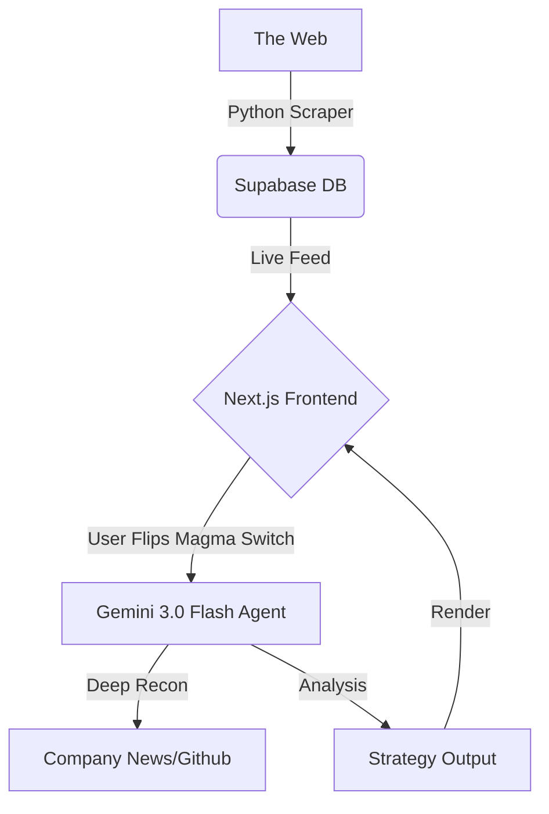

# VULCAN // The Opportunity Hunter

> **"Sometimes we need the beast to come out like RAHH."**

[](https://nextjs.org/)
[](https://www.python.org/)
[](https://supabase.com/)
[](https://deepmind.google/technologies/gemini/)
[]()

## 🌋 The Problem: Passive Aggregation
The old systems are cooling. Traditional job boards and hackathon aggregators are **passive**. They are cold storage for links. You search, you scroll, you apply into the void.

## 🔥 The Solution: Predatory Intelligence
**VULCAN** is not a search engine. It is a predatory autonomous agent. It doesn't just "find" opportunities; it hunts them, analyzes their heat signature, and forges the perfect weapon (strategy) for you to capture them.

Built for the **Info Hunter** track of the **LavaPunk Hackathon**, Vulcan turns raw data into domination.

---

## 📽️ Demo & Links
- **🚀 Live Deployment:** [Link to your Vercel Deployment]

---

## ⚔️ The "RAHH" Factor (Beast Mode)
Vulcan features a dedicated **"Magma Switch"** in the UI.

### 🌑 Obsidian Mode (Standard)
A sleek, glassmorphic dashboard that aggregates high-value opportunities (Internships, Bounties, Research) using Python scrapers. It visualizes data with cool, obsidian tones.

### 🌋 MAGMA MODE (Active)
When the user flips the toggle:
1.  **The UI Ignites:** The interface shifts to a pulsating lava-red theme using Framer Motion.
2.  **Agent Swarm:** Parallel AI agents spin up to perform "Deep Recon" on selected targets.
3.  **War Gaming:** The AI simulates a mock interview based specifically on the target's recent tech blogs and job description.
4.  **The Forge:** It auto-drafts a hyper-aggressive cold outreach message tailored to the hiring manager's public profile.

---

## 🛠️ The Arsenal (Tech Stack)

### The Foundry (Frontend)
- **Next.js 14 (App Router):** High-performance rendering.
- **Tailwind CSS:** For the "Obsidian Glass" aesthetic.
- **Framer Motion:** Powering the "Magma Switch" transitions and heat animations.
- **Lucide React:** Iconography.

### The Hunter (Backend & Data)
- **Python (Selenium/Firecrawl):** Custom scrapers that extract not just text, but *intent* and *requirements*.
- **Supabase (PostgreSQL):** Storing the "prey" (opportunities) and user profiles.
- **FastAPI:** Serving the scraping logic to the frontend.

### The Brain (AI)
- **Google Gemini 2.0 Flash:** The core intelligence.
    - Used for **"The Roast"**: Analyzing job postings and assigning a "Time Waster" score.
    - Used for **Strategy Generation**: Creating custom cover letters and interview prep.

---

## 📐 Architecture



---

## 🚀 Getting Started

### Prerequisites

* Node.js 18+
* Python 3.10+
* A Google Cloud API Key (for Gemini)
* A Supabase Project

### 1. Clone the Repo

```bash
git clone [https://github.com/yourusername/vulcan-lavapunk.git](https://github.com/yourusername/vulcan-lavapunk.git)
cd vulcan-lavapunk

```

### 2. Forge the Environment

Create a `.env.local` file in the root:

```bash
# App Secrets
NEXT_PUBLIC_SUPABASE_URL=your_supabase_url
NEXT_PUBLIC_SUPABASE_ANON_KEY=your_supabase_key
GEMINI_API_KEY=your_google_ai_key

# Scraper Config
TARGET_URLS=["[https://www.ycombinator.com/jobs](https://www.ycombinator.com/jobs)", "[https://devpost.com](https://devpost.com)"]

```

### 3. Ignite the Backend (The Hunter)

Navigate to the `/python_scraper` directory:

```bash
cd python_scraper
pip install -r requirements.txt
python hunter.py
# This will populate your Supabase DB with fresh opportunities

```

### 4. Ignite the Frontend (The Foundry)

Return to root and install dependencies:

```bash
npm install
npm run dev

```

Open [http://localhost:3000](https://www.google.com/search?q=http://localhost:3000) and witness the heat.

---

## 🧪 Key Features Breakdown

### 1. The "Roast" Engine

Vulcan doesn't respect bad job postings. The AI analyzes salary, requirements, and reviews. If a listing is "trash," Vulcan literally burns it—the card dissolves in a fire animation and is removed from the feed.

### 2. Dynamic Difficulty Adjustment

Based on your resume (uploaded to Supabase), Vulcan tags opportunities as:

* **EASY PREY:** (90% Match)
* **THE HUNT:** (60% Match - Requires Up-skilling)
* **LEVIATHAN:** (Top Tier / FAANG - Requires Magma Mode Strategy)

---

## 🏆 Tracks

**Primary:** **INFO HUNTER** (Data Aggregation)
*We aggregated data from 4 distinct sources and used LLMs to structure unstructured web data into actionable intelligence.*

**Secondary:** **CAMPUS LIFE**
*Helping students find internships without the "soul-crushing" experience of traditional portals.*

---

## 🔮 Future Roadmap

* [ ] **Automated Applications:** Letting the agent fill out the form (Selenium).
* [ ] **Github Analyzer:** Scanning the user's Github to suggest which projects to highlight for specific applications.
* [ ] **Mobile App:** React Native port for hunting on the go.

---

## 🤝 Contributors

* **zumerm** - Full Stack Engineer & Lead Alchemist


```

```
